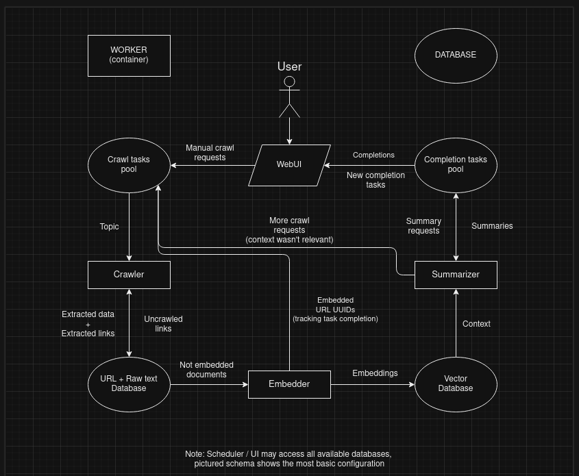
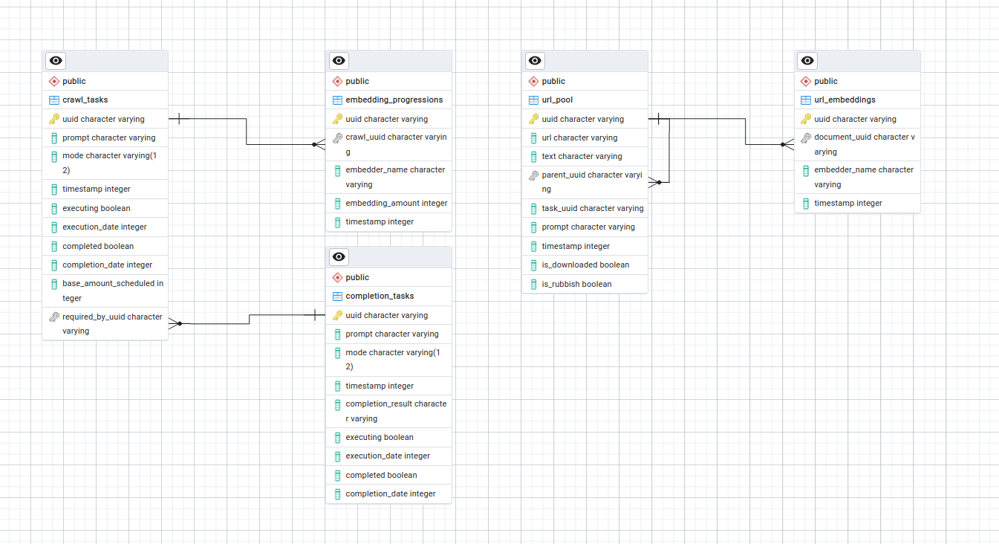

# ResearchChain

ResearchChain is a monorepo for running continuous AI-assisted research with worker services and a WebUI scheduler.

## Quick Start

### 1) Start backend services

Run all workers, database, and utilities with Docker:

`docker-compose -f docker/docker-compose.yml up`

### 2) Start WebUI frontend

The frontend runs separately:

1. `cd webui/frontend/`
2. `npm install`
3. `npm run dev`
4. Open `http://localhost:3000/`

## Postgres Access (pgAdmin)

pgAdmin is included in Docker Compose.

1. Open `http://localhost:8081/browser/`
2. Add a new server named `postgres`
3. In **Connection**:
   - Hostname/address: `postgres`
   - Username: `admin`
   - Password: `pass`
4. Save

## Notes

- Recommended Python version: `3.9`
- Default model configs: `core/models/configurations`
- `environment.yml` is for Linux; separate env files are available for Windows and macOS (Apple Silicon)

## Architecture

- **Research Chain**: worker services that process and continue research tasks
- **Schedulers**: apps that create and manage tasks (including WebUI)

## Diagrams

### WebUI Flow

### Database Schema

---

THIS SOFTWARE IS INTENDED FOR EDUCATIONAL AND RESEARCH PURPOSES ONLY.  
WE ARE NOT RESPONSIBLE FOR ANY ILLICIT USES OF THIS SOFTWARE.
